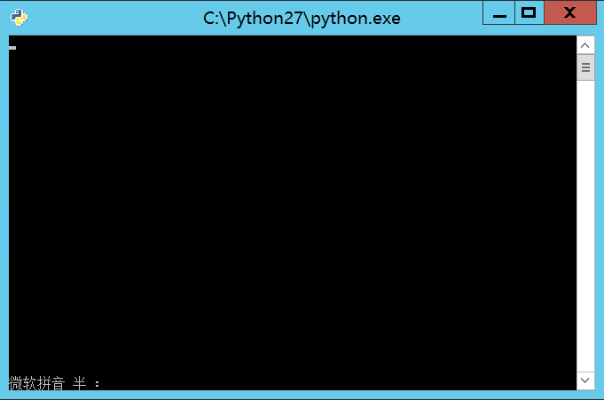

# 如何在Windows Server上搭建py-kms自助激活系统
[toc]
## 简介
py-kms是基于python语言的kms激活软件，从`VLMCSD`衍生而来，支持Windows Vista / 7 / 8 / 8.1 / 10 / Server 2008 / Server 2008 R2 / Server 2012 / Server 2012 R2 / Server 2016.
Office 2010 / Office 2013 / Office 2016.
## 一、部署环境
* 下载`Python2.7.13` [下载地址](https://www.python.org/ftp/python/2.7.13/python-2.7.13.msi)
* 下载py-kms,由于原作者[myanaloglife](https://github.com/myanaloglife/py-kms)的更新停留在2016年9月，而且经过测试没法用，故换为[SystemRage](https://github.com/SystemRage/py-kms)的，测试可用 [下载地址](https://github.com/SystemRage/py-kms)

## 二、安装
* Python安装——略
* 双击py-kms目录内的`server.py`即可看到
* Windows激活
* 此时在需要激活的电脑上摁下`win+X`键，`命令提示符(管理员)`依次键入以下命令在要激活的电脑上
```
slmgr.vbs -upk
slmgr.vbs -ipk 序列号(请在网上搜索)
slmgr.vbs -skms 服务器地址(例如：127.0.0.1)
slmgr.vbs -ato
slmgr.vbs -dlv
```
即可激活电脑

* 注意`slmgr.vbs -dlv`是查看激活信息，可略过此步
* Office激活请自行搜索

## 三、进阶（隐藏启动）
* 由于双击py-kms打开确实很方便，但是一旦不小心关掉界面就无法启动，而我们又不可能随时随地远程到服务器上去打开，因此可以通过命令行来隐藏启动`server.py`
### 使用gpedit.msc创建启动脚本
在组策略中添加脚本
#### 步骤
* `Win`+`X`打开运行，输入`gpedit.msc`,选中`计算机配置`——`Winddows配置`——`脚本（启动）`，将`start.vbs`添加进去即可
* **注意，请提前修改`start.vbs`内的`py-kms`所在目录**
* 保险起见，我决定在用户配置中也添加一个`start.vbs`，作为备份，步骤和上面相同
## 测试
参考：[http://blog.csdn.net/gsls200808/article/details/50326201](http://blog.csdn.net/gsls200808/article/details/50326201)
* 下载`vlmcsd`
* 找到目录内`\binaries\Windows\intel`下的的`vlmcs-Windows-x86.exe`对于64位的找`vlmcs-Windows-x64.exe`
将其改名为`vlmcs.exe`
* cd跳转到改目录下
`vlmcs.exe -v -l 3 192.168.1.1`
-v输出详细信息
-l 3表示发送Windows Server 2008 Datacenter的激活请求，具体版本对应列表可以通过vlmcs.exe -x查看
`192.168.1.1`表示KMS服务器的域名

输出出现
```shell
Connecting to 192.168.1.1:1688 ... successful
```
### 大功告成!

*  **如果你不在windows server环境下，你可以尝试`py-kms-start.bat`和`py-kms-start(hidden).bat`来做临时激活**
~~### .bat方法
新建一个.bat文件，命名`py-kms-start(hidden).bat`，用`notepad++`打开(类似软件均可)
填入以下信息
```
@echo off
if "%1" == "h" goto begin
mshta vbscript:createobject("wscript.shell").run("""%~nx0"" h",0)(window.close)&&exit
:begin
REM
python E:\kms\py-kms\server.py 0.0.0.0 1688
```
其中的`E:\kms\py-kms\server.py`可以替换为你自己的文件路径

* 将`py-kms-start(hidden).bat`的<u>**快捷方式**</u>添加进`C:\ProgramData\Microsoft\Windows\Start Menu\Programs\StartUp`即可

### vbs方法
<span id="vbs1">1.</span>新建一个.bat文件，命名为`py-kms-start.bat`，用`notepad++`打开(类似软件均可)
填入以下信息
```
@echo off
python E:\kms\py-kms\server.py 0.0.0.0 1688
```

其中的`E:\kms\py-kms\server.py`可以替换为你自己的文件路径
2. 新建一个.vbs文件，命名为`kms-start.vbs`,用`notepad++`打开(类似软件均可)
填入以下信息
```
dim objShell   
set objShell=wscript.createObject("WScript.Shell")   
iReturnCode=objShell.Run("E:\kms\py-kms-start.bat",0,TRUE)
```
其中的`E:\kms\py-kms-start.bat`可以替换为你自己的文件路径
**但是一定要确保该路径指向刚刚[步骤1](#vbs1)的`py-kms-start.bat`文件**

* 将`py-kms-start(hidden).bat`的<u>**快捷方式**</u>添加进`C:\ProgramData\Microsoft\Windows\Start Menu\Programs\StartUp`即可~~